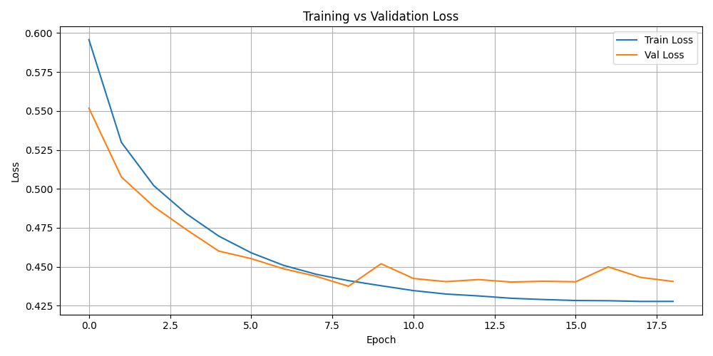
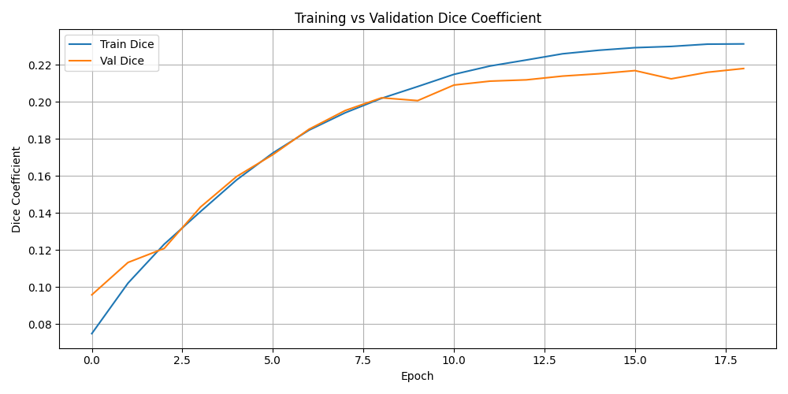

# 📝 CHANGELOG

## 📅 Update: April 25, 2025 — Model Stabilization and Training Refinements

Following early training observations, overfitting and unstable validation performance were identified during segmentation on Flair slices.  
Several corrective strategies were implemented to address these issues:

### Key Improvements

- Introduced Dropout layers and Batch Normalization after each convolutional block to enhance feature regularization and minimize overfitting.
- Reduced batch size from 64 to 16 to allow more frequent model updates and better convergence across small, slice-wise batches.
- Integrated Albumentations-based data augmentation, applying:
  - Horizontal flips
  - Shift, scale, and rotate transformations
  - Random brightness and contrast adjustments
- Continued using the ComboLoss function (0.5 × Binary Crossentropy + 0.5 × Dice Loss), with additional clipping to smooth binary mask predictions in early epochs.
- Replaced accuracy metrics with Dice Coefficient as the primary evaluation metric, better suited for imbalanced segmentation tasks.
- Enhanced visualization outputs, including both loss curves and Dice coefficient plots for training and validation sets.
- Implemented EarlyStopping with patience set to 10 epochs, and ReduceLROnPlateau scheduling to dynamically decrease the learning rate if validation performance plateaued.

### Final Training Outcome (Early Stopping at Epoch 20)

- Training was automatically stopped after 20 epochs due to no further improvements in validation loss.
- Final Loss:
  - Training Loss: ~0.425
  - Validation Loss: ~0.430
- Final Dice Coefficient:
  - Training Dice: ~0.23
  - Validation Dice: ~0.22

### Visualizations

Loss and Dice coefficient trends across epochs were captured:

- 
- 

---

## 📅 Update: April 26, 2025 — Full Training Completion and Architecture Finalization

A second phase of training was conducted, extending training beyond early stopping to fully complete 100 epochs.  
Architecture and training strategies were finalized in this phase:

### Final Model Architecture

- Utilized a 2D U-Net architecture, designed for single-channel Flair slices.
- Applied Dropout (rate = 0.2) after each convolutional block to prevent overfitting.
- Integrated Batch Normalization to stabilize gradient flow.
- Adopted Sigmoid activation in the final layer to produce binary segmentation masks.
- Maintained ComboLoss (0.5 × Binary Crossentropy + 0.5 × Dice Loss) as the loss function.
- Evaluated performance using the Dice Coefficient metric.

### Final Training Strategy Enhancements

- Continued with reduced batch size (16).
- Stronger spatial augmentations via Albumentations applied consistently across training.
- EarlyStopping with patience 20 and ReduceLROnPlateau with patience 5 were maintained.
- Model checkpointing and learning rate scheduling ensured smoother long-epoch optimization.

### Final Test Results After 100 Epochs

- Training Loss: ~0.425
- Validation Loss: ~0.430
- Test Loss: ~0.4154
- Test Dice Coefficient: ~0.2596
