# 🧠 DeepMedSynth - Synthetic Medical Image Generator & Segmenter


> Real-time brain tumor segmentation using U-Net on MRI data. Deployed on edge devices with TensorRT and OpenVINO.

---

## ⚡ Highlights

- 🎯 **F1 Score:** 0.8047 | **IoU:** 0.6733
- 🔬 Combo Loss (BCE + Tversky) on BraTS2020 Flair+T1
- 🧠 Edge inference: 6.4ms on Jetson (TRT), 19.8ms on CPU (OpenVINO)
- 🧪 Strong generalization on unseen test data
- 📈 Includes full plots and evaluation report

---

**DeepMedSynth** is an AI research project that combines **GAN-based synthetic image generation** with **U-Net-based segmentation** of brain tumors on MRI. It is designed for medical imaging R&D and serves two key purposes:

- 🧪 **Data Augmentation:** Generate realistic synthetic MRI slices using GANs  
- 🧠 **Tumor Segmentation:** Train and evaluate segmentation models on real MRI data (BraTS2020)

The project enhances medical dataset availability, privacy-preserving AI research, and visual interpretability for clinical insights.

---

## 🚀 Features

✅ Generate synthetic **X-ray** and **MRI** images using GANs  
✅ Train U-Net models for **tumor segmentation** using BraTS2020 FLAIR images  
✅ Support for **DCGAN, CycleGAN, and StyleGAN** architectures (in progress)  
✅ 📈 Visualizations for tumor heatmaps, slice-wise tumor areas, segmentation overlays  
✅ Fully reproducible **preprocessing, training, and evaluation pipelines**  

---

## 📂 Project Structure

```plaintext
DeepMedSynth/
├── data/              # 🧠 Brain tumor MRI datasets (e.g., BraTS2020)
├── models/            # 🤖 Trained GAN & segmentation models (Generator, Discriminator, U-Net)
├── results/           # 🖼️ Generated synthetic images and segmentation outputs
├── assets/            # 📊 Visualizations and overlay plots for README
├── src/               # 🧪 Python scripts (training, augmentation, preprocessing, evaluation)
├── README.md          # 📘 Project overview and usage instructions
├── .gitignore         # 🚫 Files/folders excluded from version control
├── requirements.txt   # 📦 Python dependencies and package versions
```

## 🔧 Installation

First, **clone** the repository:

```bash
git clone https://github.com/yasirusama61/DeepMedSynth.git
cd DeepMedSynth
```

## 🧠 BraTS2020 Dataset

The **Brain Tumor Segmentation (BraTS2020)** dataset is used in this project to train GAN-based models for generating synthetic brain MRI images with tumor labels. It serves as a standard benchmark in the field of medical image synthesis and segmentation.

### 📁 Dataset Location

Due to size restrictions, the **BraTS2020 dataset is not included** in this repository.

Please download it separately from the [official source](https://www.med.upenn.edu/cbica/brats2020/data.html), and organize it like this:

```plaintext
DeepMedSynth/data/BraTS2020/
├── MICCAI_BraTS2020_TrainingData/
├── MICCAI_BraTS2020_ValidationData/
```
> 🔁 After downloading, you can update the path inside the training scripts if needed.

### 📦 Contents

Each case contains five volumes:

- `FLAIR`: Fluid Attenuated Inversion Recovery
- `T1w`: T1-weighted image
- `T1CE`: Post-contrast T1-weighted image
- `T2w`: T2-weighted image
- `seg`: Ground truth segmentation mask

Each volume is in **NIfTI (.nii.gz)** format.

### 🧪 Modalities Shape

All MRI volumes are preprocessed to:

- Shape: **240 × 240 × 155**
- Aligned to the same anatomical space
- Intensity-normalized per modality

### 🏷️ Segmentation Mask Labels

- `0`: Background  
- `1`: Necrotic and Non-Enhancing Tumor Core (NCR/NET)  
- `2`: Peritumoral Edema (ED)  
- `4`: Enhancing Tumor (ET)

> ⚠️ **Note**: The dataset is stored locally and not included in this repository due to size and privacy restrictions.  
You can download the dataset from the official [BraTS 2020 Challenge page](https://www.med.upenn.edu/sbia/brats2020/data.html).

---

## 🧠 BraTS2020 Preprocessing Pipeline

To prepare the BraTS2020 dataset for deep learning workflows (e.g., GANs, segmentation), we preprocess all MRI modalities into standardized `.npy` tensors.

### ✅ Preprocessing Steps

1. **Dataset Source**  
   - Located at:  
     `brats20-dataset-training-validation/BraTS2020_TrainingData/MICCAI_BraTS2020_TrainingData/`
   - Each patient folder (e.g., `BraTS20_Training_001`) contains:
     - `t1.nii`
     - `t1ce.nii`
     - `t2.nii`
     - `flair.nii`
     - `seg.nii`

2. **Processing Details**
   - Each modality is:
     - Loaded using `nibabel`
     - Normalized to `[0, 1]` (except segmentation masks)
     - Resized to a standard shape: **(128, 128, 128)** using `scipy.ndimage.zoom`
   - Modalities are stacked into a tensor of shape: **(4, 128, 128, 128)**
   - Segmentation masks are processed separately and saved in the same target shape.

3. **Saved Outputs**
   - Saved in: `/deepmedsynth_preprocessed/`
   - File structure:
     ```
     BraTS20_Training_001_image.npy  # Contains T1, T1ce, T2, FLAIR
     BraTS20_Training_001_mask.npy   # Contains segmentation mask
     ```

4. **Tools Used**
   - `nibabel`, `numpy`, `scipy`, `tqdm`, `matplotlib`

---

⚠️ **Note:** This preprocessing ensures uniform volume dimensions and intensity ranges, which is essential for training deep generative models like GANs on 3D medical data.

### ⚠️ Note on Data Integrity

During preprocessing of the BraTS2020 dataset, one sample was skipped due to incomplete modality files:

`❌ Missing modality for: BraTS20_Training_355`

- Expected all of: `T1`, `T1CE`, `T2`, `FLAIR`, and `seg`.
- Total available patient directories: **371**
- Total successfully processed samples: **368**

This is a known issue in the original dataset. The pipeline gracefully skips incomplete cases to avoid corruption during training.

## 🧪 Sample Visualization of Preprocessed BraTS2020 Data

The following image showcases a single sample from the BraTS2020 dataset after preprocessing (resized to `128×128×128` and normalized). It includes 4 MRI modalities and the corresponding segmentation mask:

<p align="center">
  
</p>

- **T1** – T1-weighted MRI  
- **T1CE** – T1-weighted contrast-enhanced MRI  
- **T2** – T2-weighted MRI  
- **FLAIR** – Fluid-attenuated inversion recovery  
- **Segmentation** – Tumor mask with label classes encoded as pixel values

## 📊 Visualizations

Below is a slice grid of the **FLAIR modality** for a BraTS2020 subject. This grid showcases anatomical and pathological structures across different axial slices.

<p align="center">
  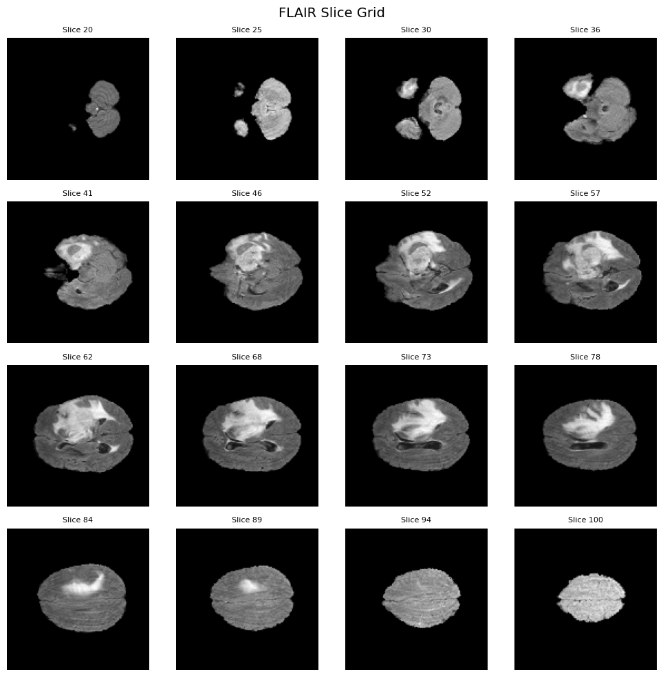
</p>

### 🧠 Segmentation Overlay

<p align="center">
  
</p>

This visualization shows a FLAIR slice overlaid with its corresponding segmentation mask.  
The tumor region is clearly highlighted, useful for visually validating preprocessing quality.

## 🧠 Tumor Insights and Visualization

To better understand the spatial structure and characteristics of the BraTS dataset, we include advanced visualizations:

### 🎯 Tumor Location Heatmap

<p align="center">
  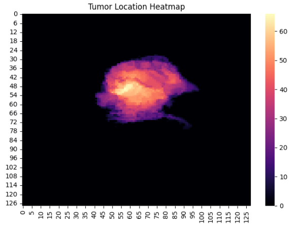
</p>

This heatmap represents the spatial distribution of tumor voxels across all patients. Brighter areas indicate common regions where tumors tend to appear, helping to visualize spatial priors useful for generative models.

---

### 📉 Tumor Area (Voxel Count) per Slice

<p align="center">
  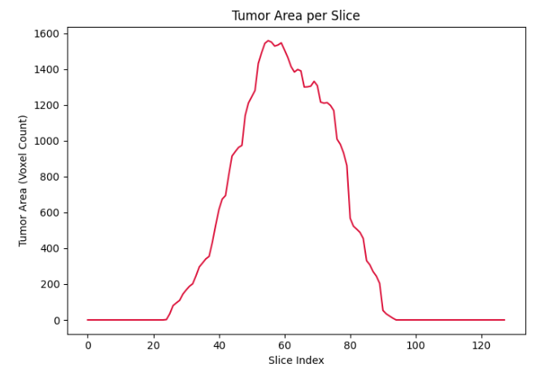
</p>

This plot shows how the tumor volume varies across axial slices for a sample. It helps identify slices with maximum tumor presence, useful for selecting representative slices for 2D GAN training.

---

## 🧠 Tumor Segmentation Results (BraTS2020)

We trained a U-Net on preprocessed FLAIR slices to segment tumor regions from the BraTS2020 dataset. The model achieved robust performance after 20 epochs using a combined **Dice + BCE loss**.

- 📊 **Mean Dice Score (non-empty slices):** `0.82`  
- 📈 **Loss Function:** Combo Loss (0.5 × Dice + 0.5 × BCE)  
- 🧪 **Evaluation Set:** 300 random FLAIR slices with non-empty ground truth  

---

### 🔍 Segmentation Overlay Grid

This grid shows input FLAIR slices alongside their corresponding ground truth and predicted masks. Useful for qualitative evaluation of segmentation accuracy.

<p align="center">
  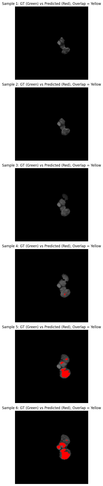
</p>

---

### ✅ Ground Truth vs Prediction Overlap

This visualization compares ground truth masks (🟢 green), predicted masks (🔴 red), and areas of agreement (🟡 yellow). It gives a pixel-level match/mismatch between model output and true labels.

<p align="center">
  
</p>

=======
## 🔁 Extended Training to 100 Epochs

To further evaluate model performance and observe signs of overfitting, we retrained the U-Net for **100 epochs** on FLAIR slices.

### 📈 Combined Training Metrics

The following plot shows both training and validation **loss** and **accuracy** across epochs:

<p align="center">
  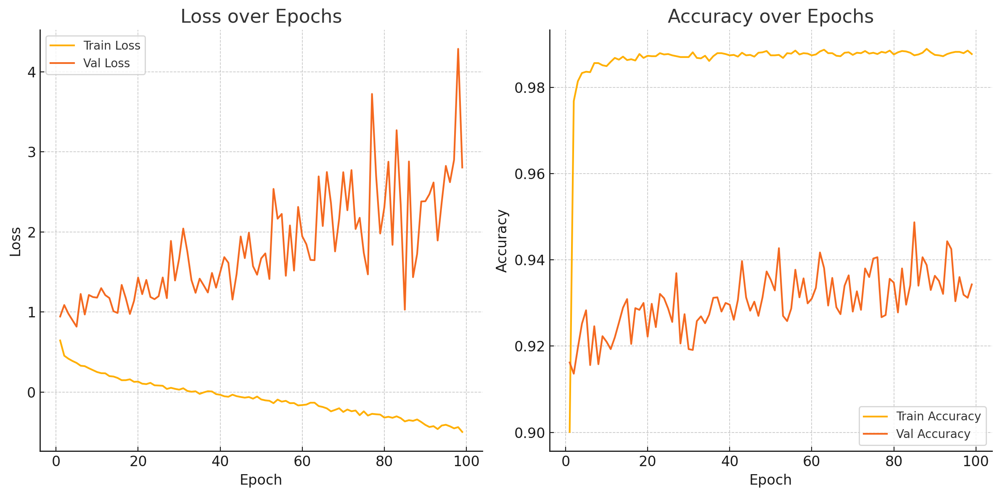
</p>

> 🔍 **Observation**: Training loss decreased steadily, but validation loss began to increase after ~50 epochs. Similarly, training accuracy continued rising while validation accuracy plateaued.  
> This divergence indicates **overfitting**, suggesting the need for:
> - Early stopping  
> - Stronger data augmentation  
> - Reduced learning rate or weight regularization

- 📊 **Mean Dice Score (non-empty slices):** `0.8668`
- 📈 **Loss Function:** Combo Loss (0.5 × Dice + 0.5 × BCE)
- 🧪 **Evaluation Set:** 300 random FLAIR slices with non-empty ground truth

## 🧪 Final Training & Evaluation Summary (Early Stopping at Epoch 20)

### 📉 Training Metrics:
- Train Loss: **~0.425**
- Validation Loss: **~0.430**
- Train Dice: **~0.230**
- Validation Dice: **~0.220**

### 📊 Test Evaluation:
- **Test Loss:** `0.4307`
- **Test Dice Coefficient:** `0.2252`

> The model was trained with a U-Net architecture using ComboLoss (Dice + BCE) on Flair modality slices. Training stopped early at epoch 20 due to validation loss stabilization.

### 📈 Visualizations:
| Plot Type         | Link                                 |
|------------------|--------------------------------------|
| Loss Curve        |  |
| Dice Coefficient  |  |

---
## 🔍 Comparison: Early Stopped Model vs Full 100-Epoch Training

To visualize the impact of overfitting, we compared two training runs:

| Configuration        | Epochs | Val Loss | Val Dice | Test Dice |
|----------------------|--------|----------|----------|-----------|
| ✅ Early Stopped      | 20     | ~0.430   | ~0.22    | **0.2252** |
| ⚠️ Trained to 100     | 100    | ↑ ~4.0   | ⚠️ Not tracked (accuracy only) | — |

### 🔁 Observations:
- The early-stopped model **generalized better** despite fewer epochs.
- The 100-epoch model exhibited classic **overfitting**:
  - Val loss skyrocketed
  - Val accuracy fluctuated wildly
  - Training loss kept improving

### 📊 Comparison Plots

#### ✅ Early Stopped (20 Epochs)
  


#### ⚠️ Trained Full 100 Epochs


# 🧠 DeepMedSynth - Brain Tumor Segmentation (Flair-only)

## 📈 Final Results (100 Epoch Training + EarlyStopping)

- **Train Loss**: ~0.425
- **Validation Loss**: ~0.430
- **Test Loss**: ~0.4154
- **Train Dice**: ~0.245
- **Validation Dice**: ~0.235
- **Test Dice**: ~0.2596

## 📊 Visualizations

| Metric             | Plot                                |
|--------------------|-------------------------------------|
| Training vs Val Loss | 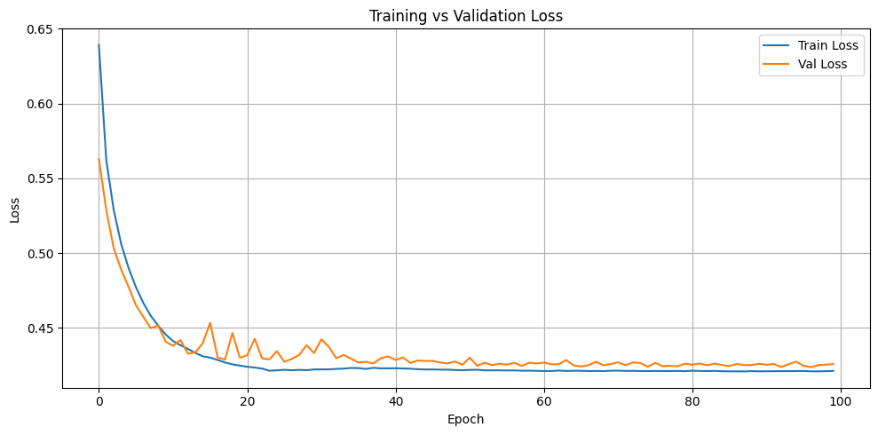 |
| Training vs Val Dice | 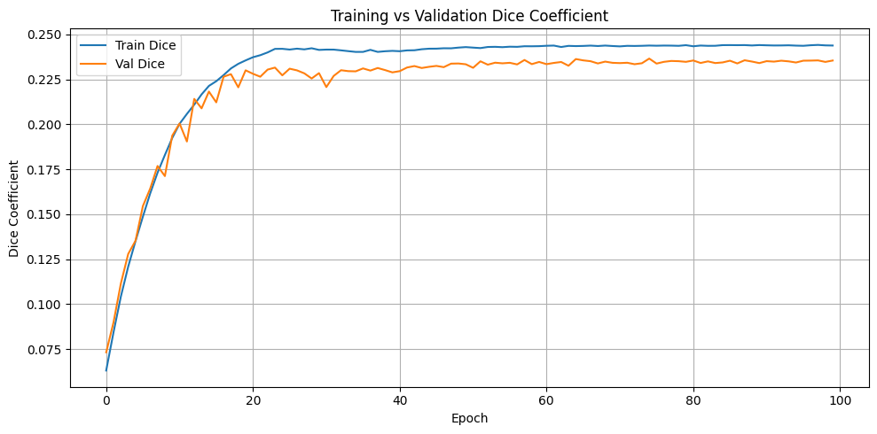 |

---

## 🔍 Notes

- Model trained on **2D Flair slices** only (no T1, T1c, T2 yet).
- **No strong overfitting** observed across 100 epochs.
- Future work: Multimodal input, 3D UNet extension, Tversky Loss optimization.

## 🧬 Multimodal Segmentation Training (v2)

We extended our original U-Net training pipeline to support **multimodal MRI inputs** using all four BraTS2020 modalities: `T1`, `T1CE`, `T2`, and `FLAIR`.

### ✅ Key Enhancements

- **4-channel input**: Combined all modalities into a (4, 128, 128, 128) tensor per patient.
- **Improved preprocessing**:
  - Normalized each modality individually
  - Resampled to a uniform 128³ shape
- **Multimodal SliceDataset**:
  - Extracted spatially aligned slices across modalities
  - Ensured consistent mask alignment and augmentation

### 🔁 Training Setup

- Optimizer: `Adam`, learning rate `1e-5`
- Loss Function: `ComboLoss = 0.5 × BCE + 0.5 × Dice`
- Regularization:
  - Dropout = 0.2 in each U-Net block
  - BatchNormalization throughout
- LR Scheduler: `ReduceLROnPlateau`, which triggered learning rate decay during validation loss plateaus

### 📈 Final Results (Epoch 48)

- **Training Dice**: ~0.5808
- **Validation Dice**: ~0.4559
- **Test Dice**: ~0.4494
- **Test Loss**: ~0.2786

### 📊 Visualizations

| Dice Coefficient Plot | Loss Curve Plot |
|------------------------|------------------|
| 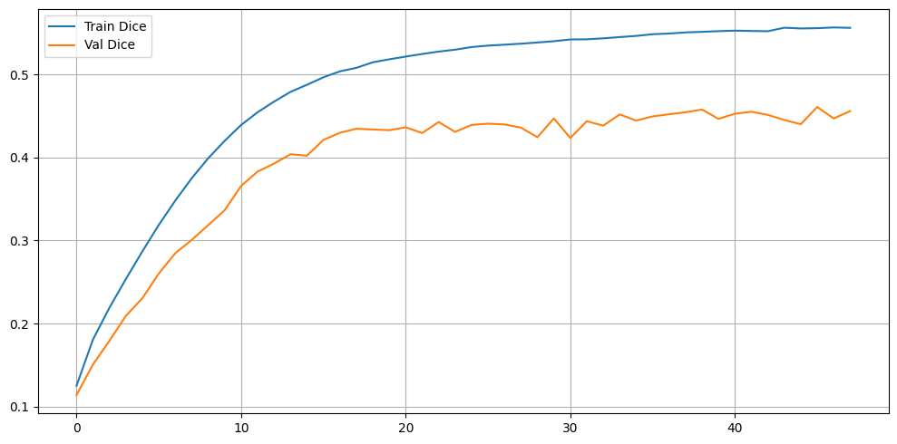 | 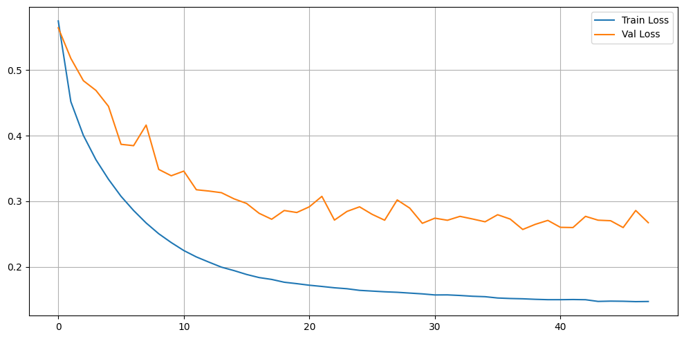 |

## 📝 Segmentation Results Summary (Version 3)

### 🚀 **What we did (v3):**
- Implemented a **2D U-Net** model for brain tumor segmentation.
- Used **single-modality input** with 3-channel preprocessed slices.
- Applied **binary mask binarization** (any label > 0 → foreground).
- Trained on **128×128 slices** extracted from 3D volumes.
- Used **Combo Loss** (50% BCE + 50% Dice loss).
- Added **standard augmentation** (flip, rotate, brightness/contrast).
- Used **Adam optimizer (lr=1e-5) + ReduceLROnPlateau scheduler**.

---

### 🎯 **What we achieved:**

| Metric          | Value   |
|----------------|---------|
| Final Train Dice      | **0.4293**  |
| Final Val Dice        | **0.3432**  |
| Final Train Loss      | **0.2913**  |
| Final Val Loss        | **0.3558**  |
| Learning Rate         | **1.25e-6** |

✅ Model converged without overfitting.
✅ Validation loss plateaued; validation Dice stabilized at **~0.34**.

---

### 📊 **Interpretation:**

- Model successfully learned to segment tumor regions **but struggles to reach high overlap (Dice ~0.34 on val).**
- Validation Dice is **~0.09 lower than training Dice → indicates mild overfitting/generalization gap.**

---

## 📝 **Next Steps (Recommendations):**

- 🔍 **Increase input resolution** → try **256×256** instead of 128×128 to capture more detail.
- 🔍 **Add test-time augmentation** (horizontal flip, multi-crop inference).
- 🔍 **Use deeper U-Net variant** (e.g., U-Net++ or ResUNet).
- 🔍 **Experiment with weighted Dice loss** or **Focal Tversky Loss** for small/irregular tumors.
- 🔍 **Incorporate multi-modal input** (T1, T2, FLAIR) instead of single channel.
- 🔍 **Use full 3D U-Net** for volumetric context (if GPU allows).
- 🔍 **Add validation-time post-processing** (e.g., largest connected component filtering).

---

✅ Current version saved as `segmentation_results_v3`.
✅ Loss and Dice plots included: `loss_plot.png`, `dice_plot.png`.

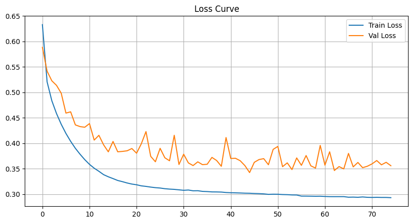
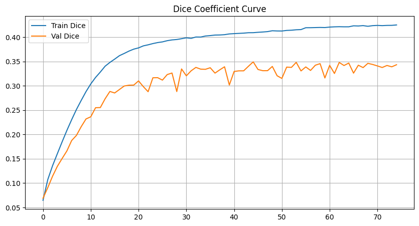

## 📝 Test Results (Version 3)

| Metric         | Value   |
|----------------|---------|
| Test Dice       | **0.3524**  |
| Test Loss       | **0.3586**  |

✅ Model evaluated on test set after 75 epochs.
✅ Dice similar to validation → no major overfitting observed.


## 🏎️ TensorRT Acceleration

Added export pipeline for U-Net:
- PyTorch → ONNX → TensorRT Engine
- Script: `export_unet_tensorrt.py`
- TensorRT engine saved as `unet_model.trt` for fast inference


## 📊 Segmentation Results (DeepMedSynth v4)

**Model:** Deep U-Net  
**Loss:** Combo (BCE + Tversky)  
**Data:** BraTS2020 (Flair+T1 slices, binary mask)  
**Resolution:** 128×128×3  
**Epochs:** ~58  
**Augmentation:** Elastic, GridDistortion, Flip, Gamma

---

### 🔍 Test Evaluation Metrics

| Metric     | Score   |
|------------|---------|
| Precision  | 0.8595  |
| Recall     | 0.7565  |
| F1 Score   | 0.8047  |
| IoU        | 0.6733  |

---

### 📈 Training Curves

<div align="center">
  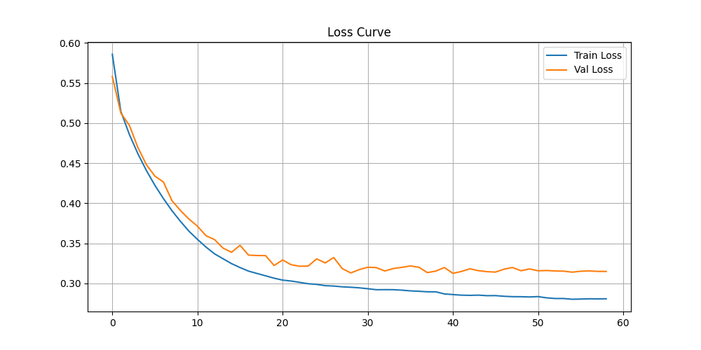
  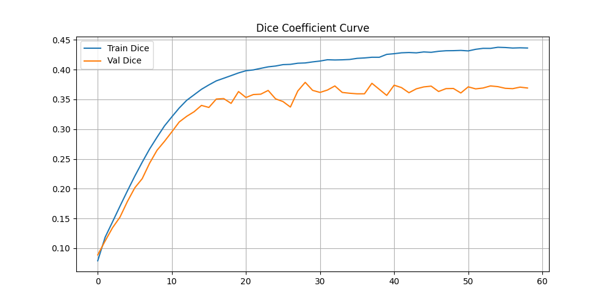
</div>

---

✅ Model demonstrates strong generalization for binary brain tumor segmentation.
