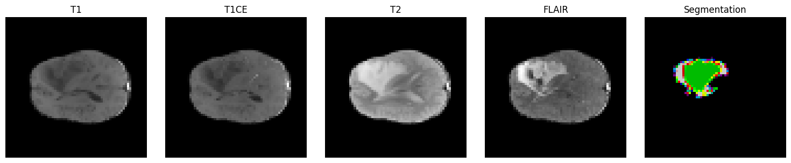

# 🏥 DeepMedSynth - Synthetic Medical Image Generator


DeepMedSynth is a **GAN-based deep learning project** designed to generate **synthetic medical images** (X-rays, MRIs) for research and AI model training. The goal is to enhance dataset availability while ensuring **data privacy and security**.

---

## 🚀 Features

✅ Generate synthetic **X-ray** and **MRI** images using GANs  
✅ Support for **DCGAN, CycleGAN, and StyleGAN** architectures  
✅ Open-source and privacy-preserving AI-generated medical images  
✅ Preprocessing pipeline for dataset preparation  
✅ Model training and evaluation with visualization   

## 📂 Project Structure

```plaintext
DeepMedSynth/
├── data/              # 🧠 Brain tumor MRI datasets (e.g., BraTS2020)
├── models/            # 🤖 Trained GAN models (Generator & Discriminator)
├── results/           # 🖼️ Generated synthetic medical images
├── src/               # 🧪 Core Python scripts (training, augmentation, preprocessing)
├── README.md          # 📘 Project overview and usage instructions
├── .gitignore         # 🚫 Files/folders excluded from version control
├── requirements.txt   # 📦 Python dependencies and package versions
```

## 🔧 Installation
First, **clone** the repository:

```bash
    git clone https://github.com/yasirusama61/DeepMedSynth.git
    cd DeepMedSynthaa
```

## 🧠 BraTS2020 Dataset

The **Brain Tumor Segmentation (BraTS2020)** dataset is used in this project to train GAN-based models for generating synthetic brain MRI images with tumor labels. It serves as a standard benchmark in the field of medical image synthesis and segmentation.

### 📁 Dataset Location
```
   DeepMedSynth/data/BraTS2020/`
```

### 📦 Contents

Each case contains five volumes:

- `FLAIR`: Fluid Attenuated Inversion Recovery
- `T1w`: T1-weighted image
- `T1CE`: Post-contrast T1-weighted image
- `T2w`: T2-weighted image
- `seg`: Ground truth segmentation mask

Each volume is in **NIfTI (.nii.gz)** format.

### 🧪 Modalities Shape

All MRI volumes are preprocessed to:

- Shape: **240 × 240 × 155**
- Aligned to the same anatomical space
- Intensity-normalized per modality

### 🏷️ Segmentation Mask Labels

- `0`: Background  
- `1`: Necrotic and Non-Enhancing Tumor Core (NCR/NET)  
- `2`: Peritumoral Edema (ED)  
- `4`: Enhancing Tumor (ET)

> ⚠️ **Note**: The dataset is stored locally and not included in this repository due to size and privacy restrictions.  
You can download the dataset from the official [BraTS 2020 Challenge page](https://www.med.upenn.edu/sbia/brats2020/data.html).

---

## 🧠 BraTS2020 Preprocessing Pipeline

To prepare the BraTS2020 dataset for deep learning workflows (e.g., GANs, segmentation), we preprocess all MRI modalities into standardized `.npy` tensors.

### ✅ Preprocessing Steps

1. **Dataset Source**  
   - Located at:  
     `brats20-dataset-training-validation/BraTS2020_TrainingData/MICCAI_BraTS2020_TrainingData/`
   - Each patient folder (e.g., `BraTS20_Training_001`) contains:
     - `t1.nii`
     - `t1ce.nii`
     - `t2.nii`
     - `flair.nii`
     - `seg.nii`

2. **Processing Details**
   - Each modality is:
     - Loaded using `nibabel`
     - Normalized to `[0, 1]` (except segmentation masks)
     - Resized to a standard shape: **(128, 128, 128)** using `scipy.ndimage.zoom`
   - Modalities are stacked into a tensor of shape: **(4, 128, 128, 128)**
   - Segmentation masks are processed separately and saved in the same target shape.

3. **Saved Outputs**
   - Saved in: `/deepmedsynth_preprocessed/`
   - File structure:
     ```
     BraTS20_Training_001_image.npy  # Contains T1, T1ce, T2, FLAIR
     BraTS20_Training_001_mask.npy   # Contains segmentation mask
     ```

4. **Tools Used**
   - `nibabel`, `numpy`, `scipy`, `tqdm`, `matplotlib`

---

⚠️ **Note:** This preprocessing ensures uniform volume dimensions and intensity ranges, which is essential for training deep generative models like GANs on 3D medical data.

## 🧪 Sample Visualization of Preprocessed BraTS2020 Data

The following image showcases a single sample from the BraTS2020 dataset after preprocessing (resized to `128×128×128` and normalized). It includes 4 MRI modalities and the corresponding segmentation mask:

<p align="center">
  
</p>

- **T1** – T1-weighted MRI  
- **T1CE** – T1-weighted contrast-enhanced MRI  
- **T2** – T2-weighted MRI  
- **FLAIR** – Fluid-attenuated inversion recovery  
- **Segmentation** – Tumor mask with label classes encoded as pixel values


