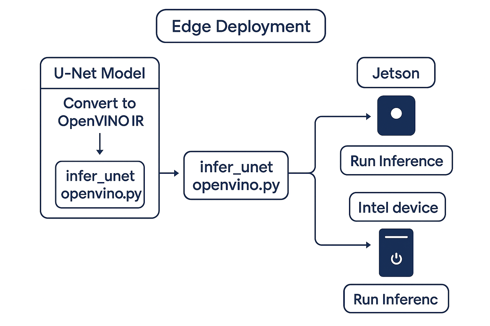
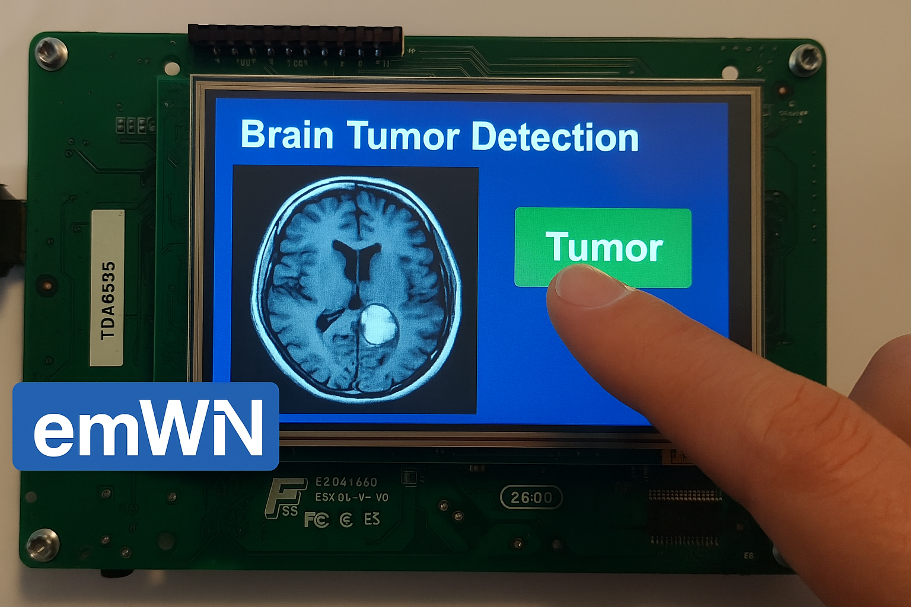

# Deployment Guide: DeepMedSynth on Edge Devices

This guide explains how to deploy the DeepMedSynth U-Net segmentation model on edge devices, including Jetson (TensorRT) and Intel-based systems (OpenVINO), with optional support for load balancing and MLOps integration.

---

## 📡 Deployment Architecture Overview

Below is a high-level visualization of how the DeepMedSynth model can be deployed on both NVIDIA Jetson (TensorRT) and Intel Edge (OpenVINO) environments with load balancing:



---

## 🧩 Real Deployment Board (Live Setup)

Below is a photo of the live embedded system running DeepMedSynth in real-time, displaying brain tumor segmentation results on the edge device touchscreen:



---

## ✅ Deployment Options

### 1. NVIDIA Jetson Devices (TensorRT)
#### Requirements:
- JetPack 4.6+ with TensorRT
- Python 3.8+
- PyCUDA, NumPy

#### Steps:
1. **Export ONNX and TensorRT engine**
   ```bash
   python scripts/export_tensorrt.py
   ```
   Generates:
   - `unet_model.onnx`
   - `unet_model.trt`

2. **Transfer to Jetson device**
   ```bash
   scp segmentation_results_v3/unet_model.trt user@jetson:/home/user/deepmedsynth/
   ```

3. **Run inference using TensorRT runtime**
   Refer to `infer_unet_tensorrt.py`. Core snippet:
   ```python
   import tensorrt as trt
   import pycuda.driver as cuda
   import pycuda.autoinit
   ```

4. **Monitor usage**
   ```bash
   tegrastats
   ```

---

### 2. Intel Devices (OpenVINO)
#### Requirements:
- OpenVINO Toolkit 2022+ (Linux or Windows)
- Model Optimizer (MO)
- Inference Engine API

#### Steps:
1. **Convert ONNX to OpenVINO IR format**
   ```bash
   mo --input_model segmentation_results_v3/unet_model.onnx \
      --output_dir segmentation_results_v3/openvino_ir \
      --input_shape [1,3,128,128]
   ```
   Produces:
   - `unet_model.xml`
   - `unet_model.bin`

2. **Run inference with Inference Engine**
   ```python
   from openvino.runtime import Core

   ie = Core()
   model = ie.read_model(model="unet_model.xml")
   compiled_model = ie.compile_model(model, device_name="CPU")
   result = compiled_model([input_image])
   ```

---

## ⚙️ Load Balancing (Optional)
To handle batch requests or multi-device setup:

- Use **FastAPI** or **Flask** to serve the model as an inference API
- Apply **round-robin** or **queue-based** scheduling across:
  - Jetson (TRT runtime)
  - Intel device (OpenVINO runtime)

```python
# Pseudocode for load routing
if client_type == "nvidia":
    call_tensorrt_inference()
elif client_type == "intel":
    call_openvino_inference()
```

---

## 🔁 MLOps & Automation Integration

To support continuous delivery and reproducibility, the following components are recommended:

### 🔄 Model Versioning
- Use DVC or MLflow to track model versions
- Store artifacts: `unet_model.onnx`, `unet_model.trt`, `unet_model.xml`

### 🔍 Monitoring and Logging
- Use `psutil`, `telegraf`, or `Prometheus` to collect system metrics
- Use `OpenVINO Performance Profiler` for runtime statistics

### 📦 Dockerized Deployment
- Containerize the inference service using Docker:

```dockerfile
FROM openvino/ubuntu20_dev
COPY unet_model.xml unet_model.bin /models/
COPY infer_unet_openvino.py /app/
CMD ["python", "/app/infer_unet_openvino.py"]
```

### 🧪 CI/CD (Optional)
- GitHub Actions or GitLab CI to run tests and redeploy when models are updated
- Auto-export and push new IR/TensorRT engines to edge devices

---

## 📌 Notes:
- Ensure inference resolution matches model input (128×128)
- Enable FP16 precision on Jetson if memory-limited
- OpenVINO inference supports both CPU and iGPU

---

✅ DeepMedSynth is now ready for production deployment across embedded and edge platforms with full support for hardware acceleration, model monitoring, and scalable service delivery.
